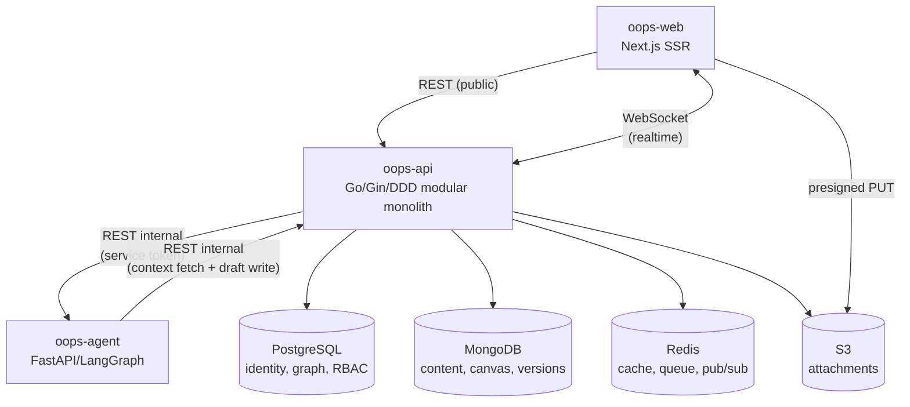
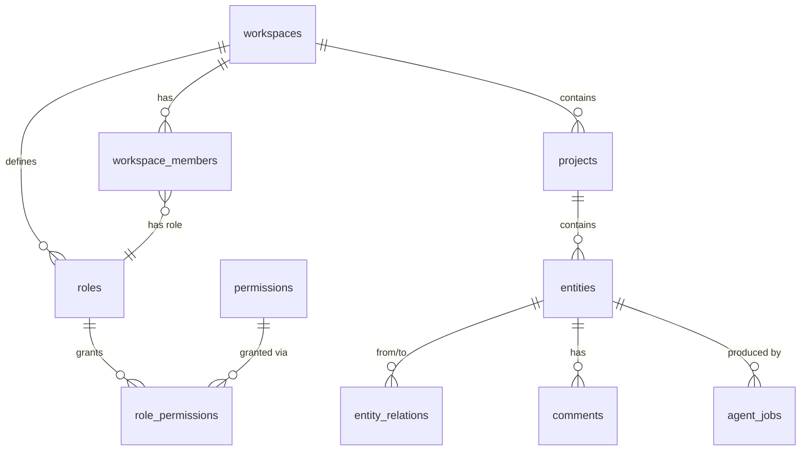
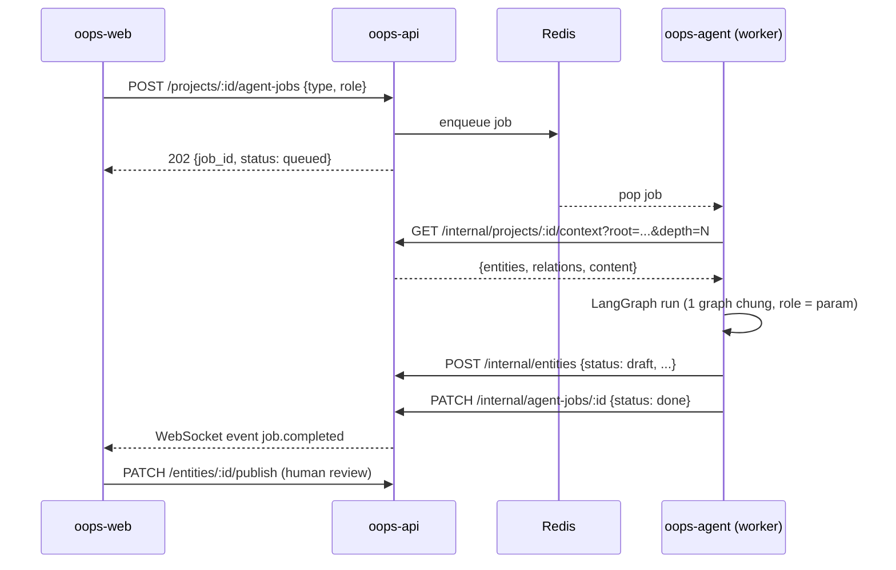
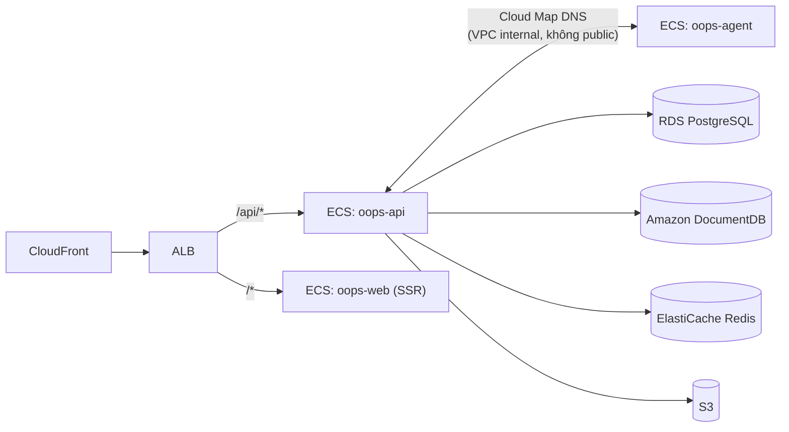

# System Design — Oops (v1)

Nguồn: `PRD.md` (root). Tài liệu này chốt các quyết định kiến trúc cụ thể cho
toàn bộ 4 phase MVP, sau phiên grill với founder ngày 2026-09-01.

---

## 1. Phạm vi

Bao phủ cả 4 phase:

| Phase | Nội dung |
|---|---|
| 1 | Authentication, Workspace, Members, Roles, Projects |
| 2 | Infinite Canvas, Semantic Nodes, Relationships, Versioning, Comments |
| 3 | Knowledge Graph, Traceability, Dependency/Impact Analysis |
| 4 | AI Copilot, Spec Generation, Flow Generation, Impact Analysis |

Không bao phủ (ngoài phạm vi tài liệu này, để lại làm quyết định riêng khi tới lúc):
billing, full-text/semantic search toàn workspace, notification system, observability chi tiết
(dùng CloudWatch mặc định theo PRD §12).

---

## 2. Nguyên tắc nền tảng

- **Multi-tenancy:** shared schema, cách ly bằng cột `workspace_id` + Postgres Row-Level Security.
  Không schema-per-tenant / database-per-tenant — quá đắt cho quy mô MVP.
- **Primary key:** UUIDv7 cho mọi bảng (time-ordered, index-friendly, tránh insert fragmentation
  của UUIDv4 ngẫu nhiên).
- **Single Source of Truth cho domain logic:** chỉ `oops-api` được ghi/đọc trực tiếp Postgres +
  MongoDB. `oops-agent` và `oops-web` không bao giờ kết nối thẳng vào database.



---

## 3. Domain Data Model (Postgres)

Module hoá theo bounded context (chi tiết mapping module ở §8).



### 3.1 Identity & Workspace (module `identity`, `workspace`)

```
users(id, email, password_hash, created_at)
workspaces(id, name, created_at)
workspace_members(workspace_id, user_id, role_id, created_at)
roles(id, workspace_id, name, is_system boolean)
permissions(id, key)               -- catalog toàn cục, không theo workspace
role_permissions(role_id, permission_id)
```

- Mỗi workspace được seed 4 role mặc định khi tạo: `Owner` (`is_system=true`, full quyền,
  không xoá/sửa permission được), `Admin`, `Member`, `Viewer` (template thường, workspace tự sửa).
- Ràng buộc bắt buộc: mỗi workspace luôn có ≥ 1 thành viên giữ role `is_system=true`. API chặn
  hành động xoá role, đổi role, hoặc remove member nếu vi phạm ràng buộc này (chống lockout).
- Auth: `oops-api` tự issue JWT (access token RS256, ngắn hạn) + refresh token lưu Redis
  (revoke được). Không dùng session cookie, không dùng IdP thứ 3.

### 3.2 Project (module `project`)

```
projects(id, workspace_id, name, description, status, created_by, created_at)
```

CRUD chuẩn, scope theo `workspace_id`, không có role override riêng theo project (role chỉ
gán ở cấp workspace — xem §3.1).

### 3.3 Semantic Model (module `semantic`)

Đây là phần lõi khác biệt của sản phẩm — tách làm 2 tầng lưu trữ:

**Postgres = identity + graph structure (system-of-record cho quan hệ):**

```
entities(id, workspace_id, project_id, type, name, status, current_version, created_at)
  -- status: draft | published  (AI-generated entity luôn tạo ở draft, xem §6)
entity_relations(id, from_entity_id, to_entity_id, relation_type, created_at)
```

**MongoDB = nội dung/rich content, versioned theo snapshot:**

```
entity_content_versions {
  entity_id, version, body: {...schema-less theo entity.type...},
  restored_from_version NULL, created_at, created_by
}
```

- `entities.current_version` trỏ tới bản mới nhất. **Restore = copy-forward**: tạo version mới
  (số tăng dần) với `body` copy từ version đích và `restored_from_version` trỏ ngược lại, rồi cập
  nhật `current_version`. Không set thẳng con trỏ về version cũ — set-pointer sẽ mất audit trail
  "ai/khi nào đã restore", trong khi sản phẩm này lấy Traceability làm giá trị lõi (PRD §2), nên
  chi phí thêm 1 row mỗi lần restore là hợp lý.
- **ID sinh ở application layer** (UUIDv7, không phải DB serial) nên không còn lý do phải insert
  Postgres trước để "lấy id". Thứ tự ghi entity mới: **Mongo trước** (`entity_content_versions`,
  dùng id đã sinh sẵn), sau đó mới insert Postgres (`entities` — bước này "kích hoạt" entity vào
  graph/RBAC/knowledge graph). Nếu bước Postgres lỗi → compensating rollback (xoá doc Mongo vừa
  tạo), trả lỗi cho client để retry. Lý do đảo thứ tự: nếu Postgres-first mà Mongo lỗi, ta có một
  entity "ma" — đã lên graph/RBAC nhưng không có content, hiện diện với người dùng khác qua list
  API dù chưa sẵn sàng. Nếu Mongo-first mà Postgres lỗi, phần thừa chỉ là 1 doc Mongo không ai trỏ
  tới — vô hại, dọn sau cũng được. Chấp nhận đây là điểm yếu nhỏ (không dùng outbox/queue) — nâng
  cấp lên outbox pattern nếu tỉ lệ lỗi ghi thực tế đủ cao để gây phiền.
- Canvas state, Flow structure, UI tree, Design artifact, AI-generated document đều là các loại
  `body` khác nhau trong cùng `entity_content_versions`, phân biệt bằng `entities.type`.

### 3.4 Knowledge Graph (module `knowledgegraph`)

Không dùng graph database riêng, không materialized closure table ở giai đoạn này — dùng
recursive CTE trực tiếp trên `entity_relations`, giới hạn depth + cycle-guard:

```sql
WITH RECURSIVE trace AS (
  SELECT from_entity_id, to_entity_id, ARRAY[from_entity_id] AS visited, 1 AS depth
  FROM entity_relations WHERE from_entity_id = :root
  UNION ALL
  SELECT r.from_entity_id, r.to_entity_id, visited || r.from_entity_id, depth + 1
  FROM entity_relations r
  JOIN trace t ON r.from_entity_id = t.to_entity_id
  WHERE depth < 20 AND NOT r.to_entity_id = ANY(visited)
)
```

Dùng cho cả Traceability (Requirement → ... → Test Case) và Impact Analysis (khi 1 entity đổi,
tìm mọi entity phụ thuộc xuôi/ngược). Nâng cấp lên materialized closure table nếu recursive CTE
không còn đủ nhanh ở quy mô thật.

### 3.5 Collaboration (module `collaboration`)

```
comments(id, entity_id, author_id, parent_comment_id NULL, body, created_at)
```

Flat table + `parent_comment_id` cho threading 1 cấp. Nằm trong Postgres (không phải Mongo) vì
cấu trúc ổn định và cần join trực tiếp với RBAC để permission-check.

Realtime: WebSocket do `oops-api` host trực tiếp (không service riêng), broadcast qua Redis
pub/sub tới mọi client đang mở cùng project. Presence (ai đang xem/ở đâu trên canvas) + các event
`node.moved`, `node.created`, `entity.updated`. Conflict resolve bằng last-write-wins: request ghi
bị từ chối (409) nếu `client.version < server.version`, buộc client re-fetch. Không dùng CRDT —
nâng cấp lên Yjs/Automerge chỉ khi có bằng chứng người dùng thật sự cần multi-cursor editing đồng
thời trên cùng field.

### 3.6 Agent Gateway (module `agentgateway`)

```
agent_jobs(id, project_id, role, type, status, requested_by, result_entity_id NULL, created_at)
  -- role: pm | architect | developer | qa | devops
  -- status: queued | running | done | failed
```

---

## 4. Auth & AuthZ tóm tắt

- Access token: JWT RS256, ngắn hạn, verify stateless (không cần gọi lại DB mỗi request).
- Refresh token: lưu Redis, revoke được (logout, đổi mật khẩu).
- Permission check: `workspace_members.role_id → role_permissions → permissions`, custom role
  editor cho phép workspace tự định nghĩa role + gán permission (không chỉ 4 role cố định).
- `oops-agent` xác thực bằng service-to-service token riêng (không dùng JWT của user).

---

## 5. AI Agent Architecture (oops-agent)



- **1 LangGraph dùng chung** cho cả 5 role (PM/Architect/Developer/QA/DevOps). Role chỉ quyết
  định system prompt + tập entity type / tool được phép gọi (vd QA Agent chỉ tạo được Test Case,
  không sửa Database entity). Tách thành graph riêng cho từng role chỉ khi có bằng chứng logic
  thực sự khác biệt tới mức không chia sẻ được node chung.
- **Context retrieval:** không dùng vector DB/embedding — Knowledge Graph traversal (§3.4) qua
  API nội bộ đã là "bản đồ ngữ nghĩa" chính xác hơn similarity search cho SDLC artifact.
  `AI Memory` (lịch sử hội thoại/quyết định với agent) lưu ở bảng đơn giản
  `ai_memory(workspace_id, role, content, created_at)`, không embedding.
- **Ghi kết quả:** AI-generated entity luôn tạo với `status: draft`. Người dùng review và
  `PATCH /entities/:id/publish` để merge vào bản chính thức. Không bao giờ AI ghi thẳng vào
  `status: published`.
- **Giao thức nội bộ:** REST + OpenAPI dùng chung schema với API public (tag riêng `internal`),
  không tách gRPC — tránh thêm toolchain khi chưa có bằng chứng cần throughput/streaming cao.

---

## 6. File Storage

Presigned URL pattern — client upload thẳng lên S3, `oops-api` không nhận byte file:

```
POST /attachments/presign {filename, content_type} -> {upload_url, s3_key}
PUT <upload_url>                                    (browser -> S3 trực tiếp)
POST /attachments {s3_key, entity_id}               -> lưu metadata Postgres
```

---

## 7. Deployment Topology (AWS)



- 3 ECS/Fargate service độc lập (`oops-web`, `oops-api`, `oops-agent`) — scale/deploy/rollback
  riêng biệt, đúng nguyên tắc "Independent Repositories" (PRD §13). Không gộp sidecar chung task
  definition.
- `oops-agent` không expose qua ALB public — chỉ nhận traffic từ `oops-api` qua Cloud Map DNS
  nội bộ VPC.
- Chốt **Amazon DocumentDB** (không dùng MongoDB Atlas) — cùng hệ sinh thái AWS với RDS/ElastiCache/
  S3, không phải quản lý thêm tài khoản/network peering ngoài AWS. Lưu ý: DocumentDB tương thích
  MongoDB API nhưng không phải bản build gốc — tránh dùng các toán tử aggregation pipeline nâng cao
  (`$graphLookup`, v.v., vốn cũng không cần vì Knowledge Graph đã dùng Postgres CTE ở §3.4) khi
  code tầng data access cho `entity_content_versions`.

---

## 8. Module boundaries — oops-api (DDD modular monolith)

Theo đúng pattern đã có sẵn ở `internal/modules/health/` (`application/{query,command}`,
`domain`, `infrastructure`, `interface`, `module.go`):

```
internal/modules/
  identity/       -- user, auth, JWT issue/verify
  workspace/      -- workspace, members, roles, permissions (RBAC)
  project/        -- project CRUD
  semantic/       -- entity, entity_relations, entity_content orchestration, versioning
  knowledgegraph/ -- traversal, traceability, impact analysis (đọc dữ liệu semantic, tách riêng
                     vì query logic phức tạp khác hẳn CRUD)
  collaboration/  -- comments, WebSocket broadcast/presence
  agentgateway/   -- internal API cho oops-agent + agent_jobs
  health/         -- đã có sẵn
```

Module sau không được gọi thẳng DB của module trước — phải qua interface layer của module đó
(giữ đúng ranh giới DDD).

---

## 9. Điểm còn mở / giả định cần xác nhận khi implement

- **Notification system** (mention trong comment, agent job xong) — chưa thiết kế, tận dụng
  WebSocket event đã có làm nền tảng khi cần.
- **Full-text/semantic search toàn workspace** — không nằm trong 4 phase MVP theo PRD, để lại
  quyết định riêng khi có yêu cầu cụ thể.
- **Outbox pattern cho ghi Postgres/Mongo** — hiện dùng compensating rollback đơn giản hơn;
  nâng cấp nếu tỉ lệ lỗi ghi thực tế đủ cao.
- **Materialized closure table** cho Knowledge Graph — nâng cấp nếu recursive CTE không đủ
  nhanh ở quy mô thật.
- **CRDT cho canvas** — nâng cấp nếu có bằng chứng cần multi-cursor editing đồng thời trên
  cùng field.

Các quyết định này (và các trade-off ở mỗi mục) nên được ghi thành ADR riêng trong
`.ai/decisions/` khi task implement thực tế bắt đầu, theo `.ai/workflows/task-flow.md` Phase 4.
